# Odin's Eye

**Full Design Process**: [Blueprint Project](https://blueprint.hackclub.com/projects/413)

A compact speed detection system using a Raspberry Pi and a TF-Luna LiDAR sensor monitors vehicles in real time. When a vehicle is detected passing by, the system measures its speed and triggers the Raspberry Pi Camera Module 3 to capture an image.

Captured images are processed locally on a Raspberry Pi Zero 2 W, where the system identifies the vehicle and, when applicable, extracts license plate information. With built-in Wi-Fi connectivity, the unit wirelessly transmits speed data and image results directly to your phone. The entire system is designed to operate autonomously, combining precise sensing, on-device image analysis, and seamless wireless communication in a compact DIY build.

## Features

- **Vehicle Speed Detection:** Real-time speed measurement using a TF-Luna LiDAR sensor
- **Automatic Photo Capture:** Raspberry Pi Camera Module 3 captures an image when a vehicle passes
- **On-Device Processing:** Raspberry Pi Zero 2 W analyzes captured images locally
- **Vehicle Recognition:** Detects vehicles within the captured image
- **License Plate Detection:** Extracts license plate information when a car is detected
- **Wireless Notifications:** Sends captured data and images directly to your phone over WiFi
- **OLED Display:** Shows detected speed and system status directly on the device
- **Autonomous Operation:** Runs continuously without manual interaction
- **Compact DIY Design:** Designed as a small, self-contained monitoring system

## Hardware/BOM

| Component | Qty | Type |
|-----------|-----|------|
| Raspberry Pi Zero 2 W | 1 | Controller |
| Raspberry Pi Camera Module 3 | 1 | Camera Module |
| TF-Luna LiDAR Sensor | 1 | LiDAR Sensor |
| 0.95-inch OLED Display | 1 | Display |
| MPU6050 IMU | 1 | Sensor |
| microSD Card (32GB) | 1 | Storage |
| Custom Carrier PCB | 1 | PCB |
| Custom 3D Printed Case | 1 | Enclosure |
| Power Bank | 1 | Power |
| USB-A to USB-C Cable | 1 | Cable |
| Universal Tripod | 1 | Mount |
| Green LED Power Indicator | 1 | Indicator |
| Mounting Hardware (Assorted Screws) | 1 | Hardware |

## CAD Screenshots

| CAD Assembly (Front View)| CAD Assembly (Back View) |
|-------------------------------|-------------------------------|
| 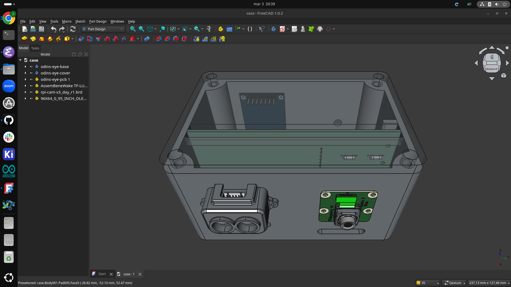 | 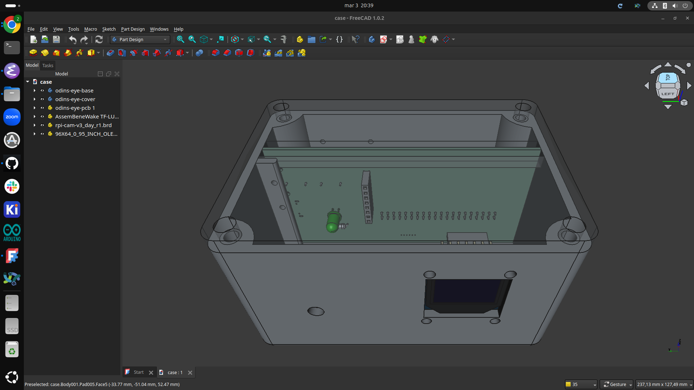 |

| 3D Case (Side View) | 3D Case (Side View) |
|----------------------|---------------------|
| 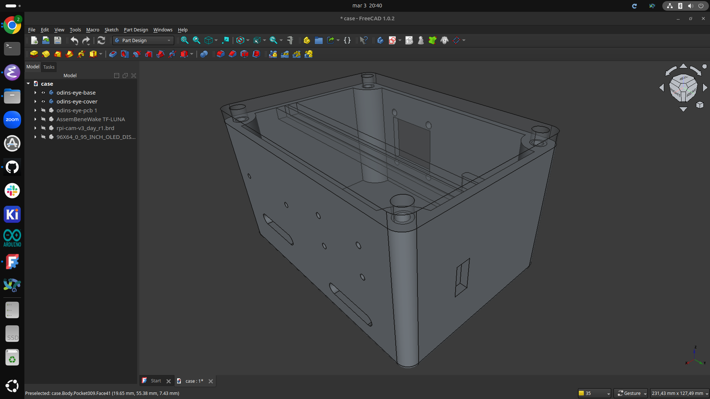 | 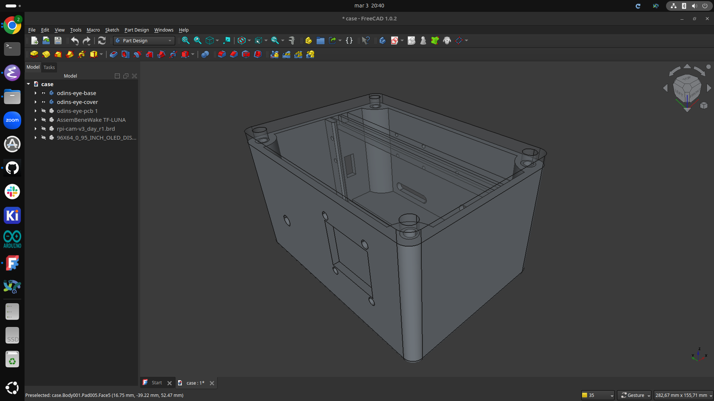 |

## PCB Screenshots

| PCB Layout |
|-------------------------------|
| 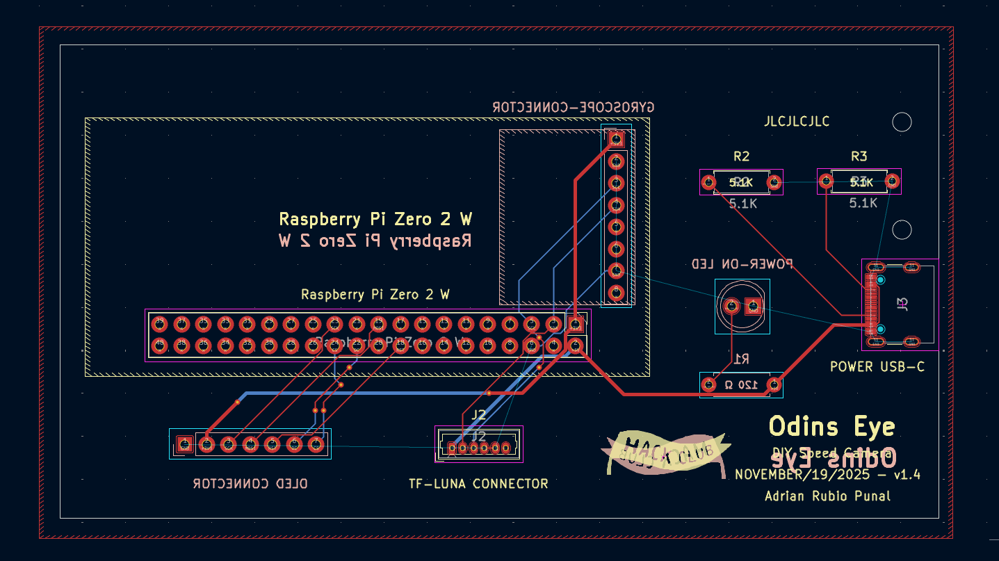 |

| PCB 3D View (Front) | PCB 3D View (Back) |
|----------------------|---------------------|
| 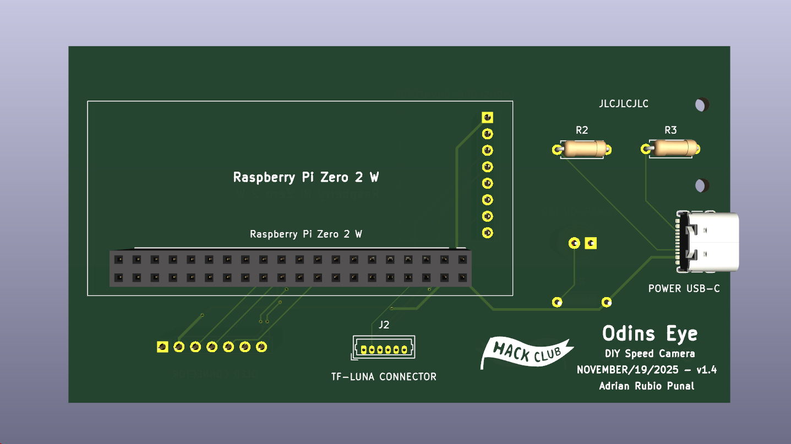 | 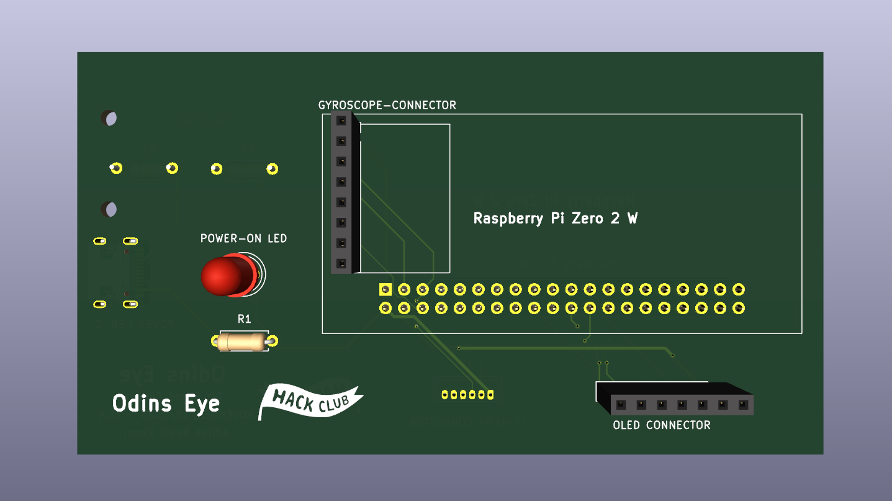 |


## Usage
Place the system facing the road and use the built-in gyroscope to help align the device at the correct angle for accurate measurements. The TF-Luna LiDAR sensor detects passing vehicles and calculates their speed, triggering the camera to capture an image as a vehicle passes. The Raspberry Pi then processes the image to detect the vehicle and extract the license plate if possible, sending the results to your phone over WiFi. The detected speed and system status are also displayed on the integrated OLED screen, allowing you to quickly view results directly on the device.

## Odins Eye In Action

| Complete Assembly |
|-------------------------------|
| 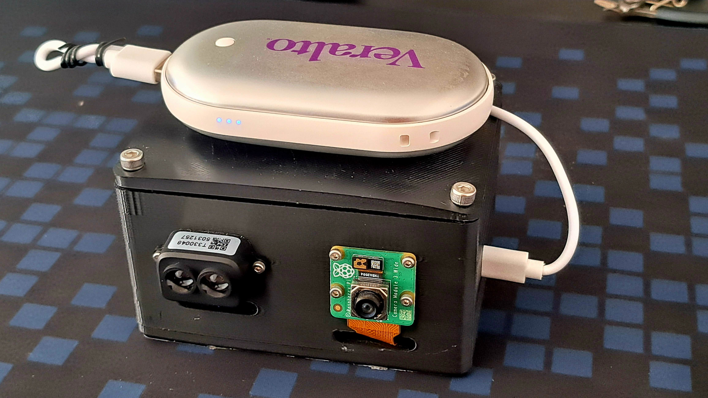 |

| Complete Assembly (Front View)| Complete Assembly (Front View) |
|-------------------------------|-------------------------------|
| 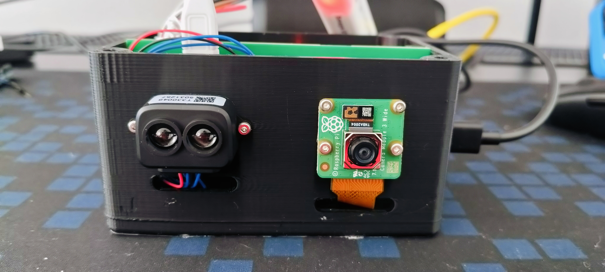 | 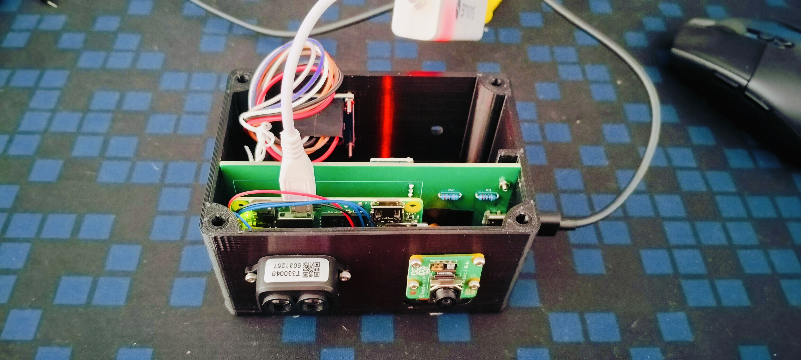 |

| Complete Assembly (Top View)| Complete Assembly (Side View) |
|-----------------------------|-------------------------------|
| 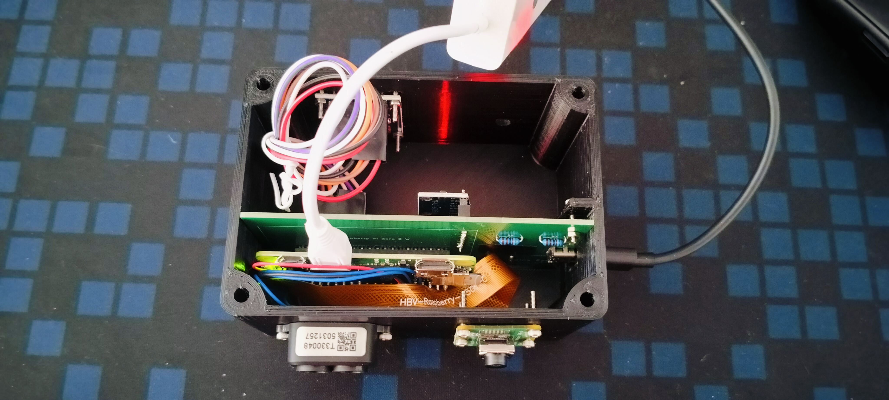 | 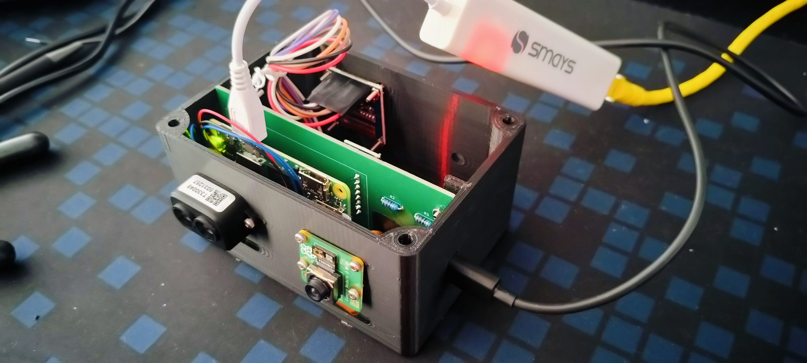 |

| Complete Assembly (Back View)| Complete Assembly (Back View) |
|------------------------------|-------------------------------|
| 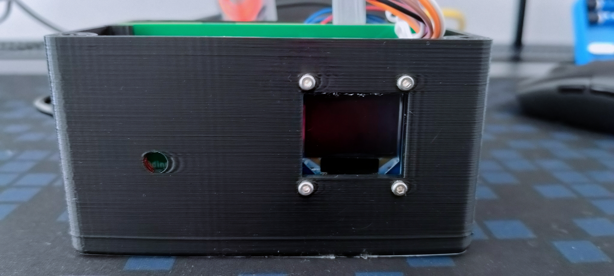 | 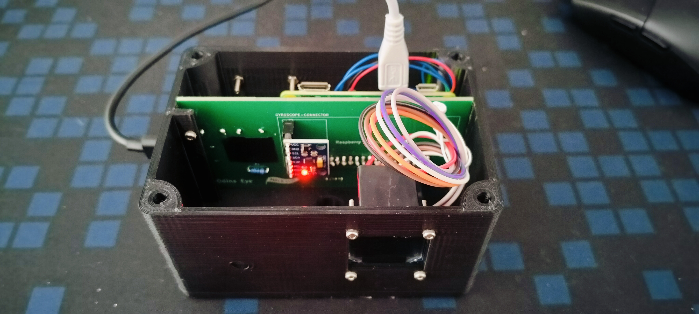 |

### Odins Eye Demo
<a href="https://github.com/adrirubio/odins-eye/raw/main/demo/video/odins-eye-demo.mp4">Click here to download the demo video (MP4)</a>

### YouTube Demo
[Watch the demo on YouTube](https://youtu.be/cNV2ZcgS8Qw)

## Running on the Pi

The firmware lives in `firmware/`. Two entry points:

- `odins_eye_speed_monitor.py` — the live detector (TF-Luna sampling, gyro calibration, camera trigger, capture metadata).
- `odins_eye_dashboard_server.py` — a small HTTP server that serves the latest captures at `http://<pi-ip>:8080`.

### One-time setup on the Pi

```bash
sudo apt install python3-pil python3-smbus2 rpicam-apps
git clone https://github.com/adrirubio/odins-eye.git ~/Documents/odins-eye
sudo bash ~/Documents/odins-eye/firmware/systemd/install.sh
```

The install script copies the systemd units into `/etc/systemd/system/`, enables them, and starts both services. After a reboot, both come up automatically.

### Manual run for roadside testing

When you want the gyro calibration prompt and live burst logs in your terminal:

```bash
sudo systemctl stop odins-eye-detector
bash ~/Documents/odins-eye/firmware/odins_eye_start.sh
```

Ctrl-C stops both detector and dashboard. To return to autostart mode:

```bash
sudo systemctl start odins-eye-detector
```

### Useful commands

```bash
systemctl status odins-eye-detector
systemctl status odins-eye-dashboard
journalctl -u odins-eye-detector -f          # live detector log
journalctl -u odins-eye-dashboard -f         # live dashboard log
```

## License

MIT License

---

> GitHub [@adrirubio](https://github.com/adrirubio) &nbsp;&middot;&nbsp;
